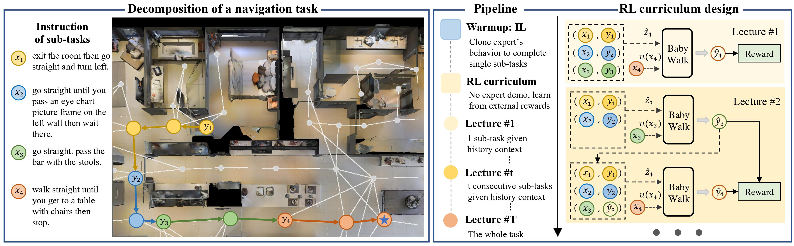

# BabyWalk: Going Farther in Vision-and-Language Navigationby Taking Baby Steps
 [](https://opensource.org/licenses/MIT) 

This is the PyTorch implementation of our paper:

**BabyWalk: Going Farther in Vision-and-Language Navigationby Taking Baby Steps**<br>
Wang Zhu*, Hexiang Hu*, Jiacheng Chen, Zhiwei Deng, Vihan Jain, Eugene Ie, Fei Sha<br> 
2020 Annual Conference of the Association for Computational Linguistics (ACL 2020)

[[arXiv](http://arxiv.org/abs/2005.04625)] [[GitHub](https://github.com/Sha-Lab/babywalk)]

## Abstract
Learning to follow instructions is of fundamental importance to autonomous agents for vision-and-language navigation (VLN). In this paper, we study how an agent can navigate long paths when learning from a corpus that consists of shorter ones. We show that existing state-of-the-art agents do not generalize well. To this end, we propose BabyWalk, a new VLN agent that is learned to navigate by decomposing long instructions into shorter ones (BabySteps) and completing them sequentially. A special design memory buffer is used by the agent to turn its past experiences into contexts for future steps. The learning process is composed of two phases. In the first phase, the agent uses imitation learning from demonstration to accomplish BabySteps. In the second phase, the agent uses curriculum-based reinforcement learning to maximize rewards on navigation tasks with increasingly longer instructions. We create two new benchmark datasets (of long navigation tasks) and use them in conjunction with existing ones to examine BabyWalk's generalization ability. Empirical results show that BabyWalk achieves state-of-the-art results on several metrics, in particular, is able to follow long instructions better. 
<br> <br>


## Installation

1. Install Python 3.7 (Anaconda recommended: https://www.anaconda.com/distribution/).
2. Install PyTorch following the instructions on https://pytorch.org/ (we used PyTorch 1.1.0 in our experiments).
3. Download this repository or clone with Git, and then enter the root directory of the repository:  
```
git clone https://github.com/Sha-Lab/babywalk
cd babywalk
```
4. Check the installation of required packages in requirement.txt.
5. Download and preprocess the data
```
chmod +x download.sh
./download.sh
```
After this step, check
+ `simulator/resnet_feature/` should contain `ResNet-152-imagenet.tsv`. 
+ `simulator` should contain `total_adj_list.json`, which replace the Matterport3D simulator
+ `src/vocab/vocab_data` should contain vocabulary and its glove embedding files `train_vocab.txt` and `train_glove.npy`.
+ `tasks/` should contain `R2R`, `R4R`, `R6R`, `R8R`, `R2T8`, each which a data folder in it containing training/evaluation data.

## Training and evaluation
Here we take training on R2R as an example, using BABYWALK.

### Warmup with IL
```
CUDA_VISIBLE_DEVICES=0 python src/train_follower.py \
    --split_postfix "_landmark" \
    --task_name R2R \
    --n_iters 30000 \
    --model_name "follower_bbw" \
    --il_mode "landmark_split" \
    --one_by_one \
    --one_by_one_mode "landmark" \
    --history \
    --log_every 1000
```

### Training with CRL
```
CUDA_VISIBLE_DEVICES=0 python src/train_follower.py \
    --split_postfix "_landmark" \
    --task_name R2R \
    --n_iters 30000 \
    --curriculum_iters 5000 \
    --model_name "follower_bbw_crl" \
    --one_by_one \
    --one_by_one_mode "landmark" \
    --history \
    --log_every 500 \
    --reward \
    --reward_type "cls" \
    --batch_size 64 \
    --curriculum_rl \
    --max_curriculum 4 \
    --no_speaker \
    --follower_prefix "tasks/R2R/follower/snapshots/follower_bbw_sample_train_iter_30000"
```

### Other baselines
Here we take training on R2R as an example, using Speaker-Follower and Reinforced Cross-modal Matching.
+ Speaker-Follower
```
CUDA_VISIBLE_DEVICES=0 python src/train_follower.py \
    --task_name R2R \
    --n_iters 50000 \
    --model_name "follower_sf_aug" \
    --add_augment
CUDA_VISIBLE_DEVICES=0 python src/train_follower.py \
    --task_name R2R \
    --n_iters 20000 \
    --model_name "follower_sf" \
    --follower_prefix "tasks/R2R/follower/snapshots/best_model"
```
+ Reinforced Cross-modal Matching
```
CUDA_VISIBLE_DEVICES=0 python src/train_follower.py \
    --task_name R2R \
    --n_iters 20000 \
    --model_name "follower_rcm_cls" \
    --reward \
    --reward_type "cls" \
    --batch_size 64 \
    --no_speaker \
    --follower_prefix "tasks/R2R/follower/snapshots/follower_sf_aug_sample_train-literal_speaker_data_augmentation_iter_50000"
```

### Evaluation
Here we take model trained on R2R, using BABYWALK as an example. <br>
 + Evaluate on the validation unseen data of Room 2-to-8.
```
CUDA_VISIBLE_DEVICES=0 python src/val_follower.py \
    --task_name R2T8 \
    --split_postfix "_landmark" \
    --one_by_one \
    --one_by_one_mode "landmark" \
    --model_name "follower_bbw"
    --history \
    --follower_prefix "tasks/R2R/follower/snapshots/best_model"
```

 + Evaluate on the validation seen / unseen data of R**x**R (**x**=2,4,6,8).
   + change ``` --task_name R2T8 ``` to ``` --task_name RxR ```
 + Evaluate on the test data of R2R.
   + set ``` --task_name R2R ```
   + add ``` --use test ```
 + For SF/RCM models, evaluate on R**x**R (**x**=2,4,6,8).
   + set ``` --task_name RxR ```
   + set ``` --max_steps 5*x ``` and ``` --max_ins_len 50*x ```
## Download reported models in our paper
```
chmod +x download_model.sh
./download_model.sh
```
### Performance of our models
**SDTW**
| Trained  | Eval R2R | Eval R4R | Eval R6R | Eval R8R |
|:--------:|:--------:|:--------:|:--------:|:--------:|
|   R2R    |   36.9   |   13.8   |   11.2   |   9.8    |
|   R4R    |   27.8   |   17.3   |   13.6   |   11.1   |
|   R6R    |   25.4   |   15.1   |   11.8   |   9.9    |
|   R8R    |   26.2   |   15.2   |   11.8   |   10.1   |

**CLS**
| Trained  | Eval R2R | Eval R4R | Eval R6R | Eval R8R |
|:--------:|:--------:|:--------:|:--------:|:--------:|
|   R2R    |   54.4   |   51.0   |   49.0   |   48.7   |
|   R4R    |   50.4   |   49.4   |   47.2   |   46.0   |
|   R6R    |   50.0   |   48.6   |   47.4   |   46.3   |
|   R8R    |   49.3   |   48.5   |   46.6   |   46.4   |

# Citation 

Please citing the follow BibTex entry if you are using any content from this repository:
```
@inproceedings{zhu2020babywalk,
    title = "{B}aby{W}alk: Going Farther in Vision-and-Language Navigation by Taking Baby Steps",
    author = "Zhu, Wang and Hu, Hexiang and Chen, Jiacheng and Deng, Zhiwei and Jain, Vihan and Ie, Eugene and Sha, Fei",
    booktitle = "Proceedings of the 58th Annual Meeting of the Association for Computational Linguistics",
    year = "2020",
    publisher = "Association for Computational Linguistics",
    pages = "2539--2556",
}
```

